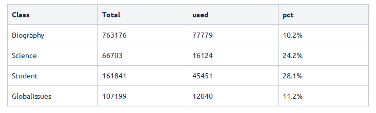

# Wrapper service

DBC har lavet en wrapper service der:

* sender en søgning videre mod Watson Discovery

* laver clustering: resultaterne opdeles i tre klasser baseret på metadata

* tilføjer Gale-metadata

Eksempel (hvor `key` er en token der udleveres af DBC):

```
curl -X POST http://verdens-klogeste-1-0.mi-prod.svc.cloud.dbc.dk/query -d '{"query": "trump", "key": "xxxxxxxx"}'
```

Dette vil give json retur, svarende til Watson Discoverys API, men hvor der for hvert resultat i `results` under `metadata` er tilføjet:

* "cluster_id" som angiver hvilket cluster resultatet tilhører.

* `gale` som indeholder:

  * `gale-collection` der angiver hvilken Gale-collection dokumentet kommer fra

  * `gale-fake-level` der er en int 0-99 der kan bruges til at simulere niveau (fx folkeskole/gymnasium)
  
  * `gale-fake-waiting` der er en int 0-99 der kan bruges til at simulere hvor lang tid der går før materialet kan leveres

Eksempel:
```
...
           "title" : "Donald John Trump",
            "gale" : {
               "gale-fake-level" : 88,
               "gale-collection" : "Student",
               "gale-fake-waiting" : 41
            },
            "docid" : "EJ1667000175",
           "cluster_id" : 0
 ...
 ```
# Data

Dokumenterne der er lagt i Discovery er taget fra Gale og udvalgt udfra størrelse, dvs. kun dokumenter over en vis størrelse er lagt ind (for at systemet har tekst at arbejde på).

Dokumenterne er taget fra følgende samlinger ("used" er det antal der er lagt ind i Discovery):



# Watson Discovery

Dette er kode til indlæsning af dokumenter i Watson Discovery (se src).

Processen er:

* dokument behandles med Watson NLU for at få concepts, entities og keywords.

* dokument og metadata fra Watson NLU indlægges i Watson Discovery

Herefter kan dokumenter fremsøges ved brug af Watson Discovery's API.


